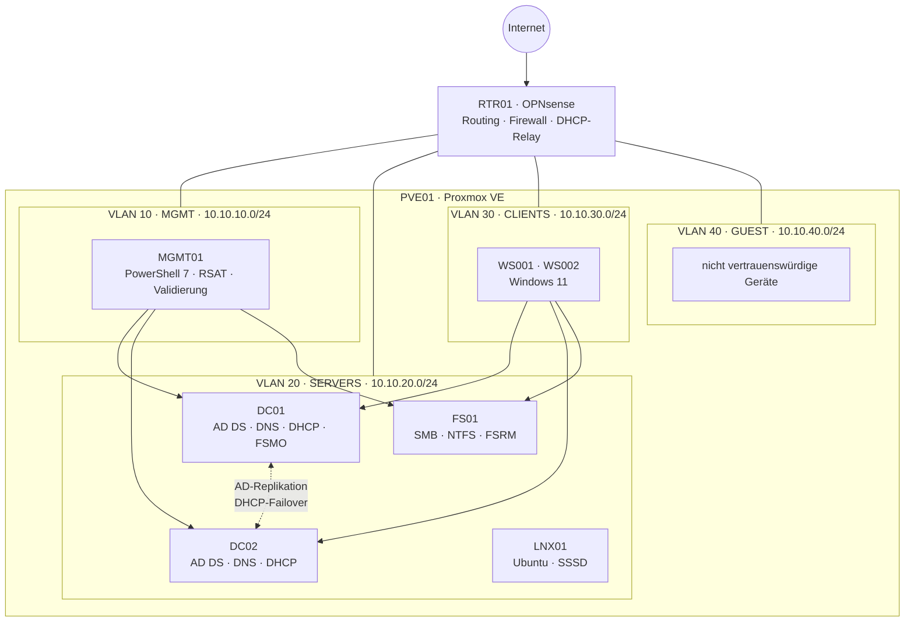

# nrw-corp-lab

[](https://github.com/ATarasovHub/nrw-corp-lab/actions/workflows/lint.yml)
[](LICENSE)

[English](README.md) | **Deutsch**

Ein reproduzierbares Windows-Server-2025-Unternehmenslab für eine fiktive Firma mit 30 Mitarbeitenden in NRW – von Proxmox-VMs bis zu getesteten Active-Directory-, Gruppenrichtlinien-, Dateidienst- und Recovery-Automationen.

## Architektur



Der Router erzwingt eine Default-Deny-Policy zwischen den VLANs. Zwei beschreibbare DCs stellen redundantes AD-integriertes DNS und DHCP im Lastenausgleich bereit; Benutzer, Berechtigungen, GPOs, Backups und Validierung werden aus Code erzeugt.

## Technologie-Stack

| Ebene | Technologie | Verwendung im Projekt |
| ----- | ----------- | --------------------- |
| Virtualisierung | Proxmox VE 8 | VLAN-fähige Bridge und Lab-VMs |
| Images / IaC | Packer, Terraform (`bpg/proxmox`) | Unbeaufsichtigte Server-2025-Templates und VM-Lebenszyklus |
| Netzwerk | OPNsense | Routing, Stateful Firewall, DHCP-Relay, Upstream-DNS |
| Identität | Windows Server 2025 AD DS | Zwei DCs, DNS, Papierkorb, Sites, Admin-Tiering |
| Adressierung | Windows DHCP | 50/50-Failover, sichere dynamische DNS-Updates |
| Richtlinien | Group Policy, Windows LAPS | Kennwörter, Baseline, Updates, Laufwerke, lokale Admins |
| Speicher | SMB, NTFS, FSRM | AGDLP-ACLs, ABE, Kontingente, Home-Verzeichnisse |
| Recovery | Windows Server Backup, `ntdsutil` | System State, Volume-Backup, IFM, Restore-Test |
| Automation | PowerShell 7 | Idempotente Skripte mit `-WhatIf`; Sollzustand in `data/` |
| Qualität | Pester, PSScriptAnalyzer, GitHub Actions | Unit-, Live- und statische Tests |

## Schnellstart

Benötigt werden Proxmox VE 8 mit mindestens 32 GB RAM, VLAN-fähiges `vmbr1`, WAN-Bridge `vmbr0`, Windows-Server-2025-/VirtIO-/OPNsense-ISOs, Packer 1.11+, Terraform 1.6+ und PowerShell 7. Details stehen unter [Infrastructure](infra/README.md).

1. Repository klonen und Core-/Desktop-Experience-Templates bauen.

   ```bash
   git clone https://github.com/ATarasovHub/nrw-corp-lab.git
   cd nrw-corp-lab/infra/packer/windows-server-2025
   cp windows-server-2025.pkrvars.hcl.example windows-server-2025.pkrvars.hcl
   export PKR_VAR_proxmox_token='<Token-Geheimnis>'
   export PKR_VAR_admin_password='<Build-Kennwort>'
   packer init .
   packer build -var-file=windows-server-2025.pkrvars.hcl -var edition=core .
   packer build -var-file=windows-server-2025.pkrvars.hcl -var edition=desktop .
   ```

2. VMs bereitstellen; DHCP-Clients zunächst ausgeschaltet lassen.

   ```bash
   cd ../../terraform
   cp terraform.tfvars.example terraform.tfvars
   export PROXMOX_VE_API_TOKEN='terraform@pve!terraform=<Geheimnis>'
   export TF_VAR_windows_admin_password='<lokales Admin-Kennwort>'
   terraform init
   terraform plan -out tfplan
   terraform apply tfplan
   ```

3. RTR01 nach [02 — Network](docs/02-network.md) installieren: VLANs, Default-Deny-Firewall, DHCP-Relay und Unbound.

4. In einer erhöhten PowerShell-7-Sitzung die Gesamtstruktur auf DC01 erstellen und DC02 hinzufügen.

   ```powershell
   # DC01 (nach dem Neustart ohne Kennwortparameter erneut ausführen)
   .\scripts\Domain\Initialize-Domain.ps1 -SafeModeAdministratorPassword (Read-Host -AsSecureString) -Restart
   .\scripts\Domain\Initialize-Domain.ps1
   .\scripts\Domain\Set-DnsConfiguration.ps1

   # DC02
   .\scripts\Domain\Add-ReplicaDomainController.ps1 -Credential (Get-Credential NRWCORP\Administrator) -SafeModeAdministratorPassword (Read-Host -AsSecureString) -Restart
   .\scripts\Domain\Add-ReplicaDomainController.ps1 -Credential (Get-Credential NRWCORP\Administrator)
   ```

5. OU-/Gruppen-/Benutzermodell und DHCP erstellen, Mitgliedsserver verbinden, anschließend WS001/WS002 starten und zur Domäne hinzufügen.

   ```powershell
   # DC01
   .\scripts\Directory\New-AdOuStructure.ps1
   .\scripts\Directory\Import-LabUsers.ps1
   .\scripts\Network\New-DhcpScopes.ps1 -FailoverSharedSecret (Read-Host -AsSecureString)
   ```

   Danach `start_clients = true` setzen, Terraform erneut anwenden und `Join-LabDomain.ps1` auf FS01, MGMT01 und den Clients ausführen. Die vollständige Reihenfolge steht in [scripts/README.md](scripts/README.md).

6. Dateidienste und Gruppenrichtlinien ausrollen, anschließend die Live-GPOs exportieren.

   ```powershell
   # FS01
   .\scripts\FileServer\New-FileShares.ps1

   # DC01
   .\scripts\GroupPolicy\Set-FineGrainedPasswordPolicy.ps1
   .\scripts\GroupPolicy\New-LabGpo.ps1
   .\scripts\GroupPolicy\Export-LabGpo.ps1
   ```

7. Jeden Windows-Infrastrukturserver auf ein separates Medium sichern und von MGMT01 validieren.

   ```powershell
   # DC01, DC02 und FS01
   .\scripts\Backup\Backup-LabEnvironment.ps1 -BackupTarget E:

   # MGMT01
   .\scripts\Validation\Invoke-LabValidation.ps1
   ```

Geheimnisse werden ausschließlich als Parameter oder Umgebungsvariablen übergeben. `terraform.tfstate`, `*.tfvars`, erzeugte Zugangsdaten, Backup-Medien und Transkripte dürfen nicht committet werden.

## Designentscheidungen

- **Zwei DCs, eine Domäne.** Authentifizierung, DNS und DHCP überstehen den Neustart eines DCs ohne unnötige Mehrdomänen-Komplexität.
- **Segmentierung vor Diensten.** MGMT, SERVERS, CLIENTS und GUEST haben verschiedene Vertrauensstufen; RTR01 erlaubt nur dokumentierte Verbindungen.
- **Server Core als Standard.** DCs und FS01 haben weniger Angriffs- und Patchfläche; die Administration bleibt auf MGMT01.
- **AGDLP für Berechtigungen.** Benutzer sind Mitglieder globaler Rollengruppen, diese wiederum Mitglieder domänenlokaler Ressourcengruppen; nur Ressourcengruppen stehen in ACLs.
- **Kleine, zweckgebundene GPOs.** Default Policies bleiben unverändert; jede eigene GPO hat einen dokumentierten Scope und lässt sich separat exportieren/wiederherstellen.
- **Sollzustand plus Live-Tests.** CSV/PSD1 beschreibt die Absicht; Pester prüft zusätzlich Replikation, echte DHCP-Lease, RSoP und genaue NTFS-ACLs.
- **Backup ist noch kein Recovery-Nachweis.** System State ist die Wiederherstellungsquelle, IFM nur ein Beschleuniger; RT-01 dokumentiert den isolierten Restore-Test.

Kontext und Konsequenzen: [01 — Architecture](docs/01-architecture.md#design-decisions).

## Validierung

Unit-Tests laufen in GitHub Actions; Live-Tests ausschließlich im Lab:

```powershell
Invoke-Pester -Path .\tests\Unit
.\scripts\Validation\Invoke-LabValidation.ps1 -OutputPath C:\TestResults\integration.xml
```

Voraussetzungen und Fehlerinterpretation stehen in [06 — Validation](docs/06-validation.md). Deployment-Nachweise werden unter [docs/screenshots](docs/screenshots/README.md) verwaltet; dort gehören nur Screenshots fertiger Ergebnisse hin.

## Einschränkungen

- Das Projekt ist ein Lern-/Referenzlab, kein unterstütztes Produktions-Blueprint und kein Ersatz für ein Sicherheitsaudit.
- PVE01 samt Storage bleibt ein Single Point of Failure; zwei DCs machen den Hypervisor nicht hochverfügbar.
- OPNsense-Installation und Firewall-Eingabe sind dokumentiert, aber noch nicht automatisiert.
- AD CS, Entra ID, Exchange, SIEM/EDR, Monitoring, WSUS und ein zentraler Secrets Vault fehlen.
- Clients laden Updates direkt von Microsoft; Server benötigen weiterhin ein Wartungsfenster.
- Die Aufbewahrung der Backups hängt vom externen Ziel ab. RT-01 bleibt **ausstehend**, bis ein echter isolierter Restore erfolgreich war.
- Live-`Backup-GPO`-Exporte, JUnit-Nachweise und 5–8 Ergebnis-Screenshots können erst nach dem Deployment entstehen; das Repository erfindet sie nicht.
- Evaluierungsmedien sowie Microsoft-/OPNsense-Lizenzen liegen in der Verantwortung des Betreibers.

## Dokumentation

Die technische Detaildokumentation ist auf Englisch.

| Dokument | Inhalt |
| -------- | ------ |
| [01 — Architecture](docs/01-architecture.md) | Topologie, Inventar und ADR-Entscheidungen |
| [02 — Network](docs/02-network.md) | VLANs, IP-Plan, DNS, DHCP, Firewall |
| [03 — AD Design](docs/03-ad-design.md) | OU-Modell, Benennung, AGDLP, Admin-Tiers |
| [04 — Group Policy](docs/04-gpo.md) | GPO-Einstellungen, Begründungen, Export/Restore |
| [05 — Backup and Restore](docs/05-backup-restore.md) | Recovery-Ziele, Runbooks und RT-01 |
| [06 — Validation](docs/06-validation.md) | Unit-/Live-Pester-Tests und JUnit-Nachweis |
| [99 — Troubleshooting](docs/99-troubleshooting.md) | Symptome, Diagnose und bekannte Probleme |
| [Infrastructure](infra/README.md) | Packer-Templates und Terraform-Deployment |
| [Scripts](scripts/README.md) | Exakte Ausführungsreihenfolge pro Host |

## Repository-Struktur

```text
.github/workflows/  statische Analyse, Unit-Tests, Terraform-/Packer-Validierung
data/               Sollzustand für OUs, Benutzer, Gruppen, DHCP, Freigaben, GPOs
docs/               Architektur, Betrieb, Recovery und Troubleshooting
gpo/                versionierte Backup-GPO-Exporte nach Live-Deployment
infra/              Packer, Terraform und cloud-init
scripts/            PowerShell-7-Deployment, Backup und Validierung
tests/               CI-Unit-Tests und Live-Integrationstests
```

## Lizenz

[MIT](LICENSE)
