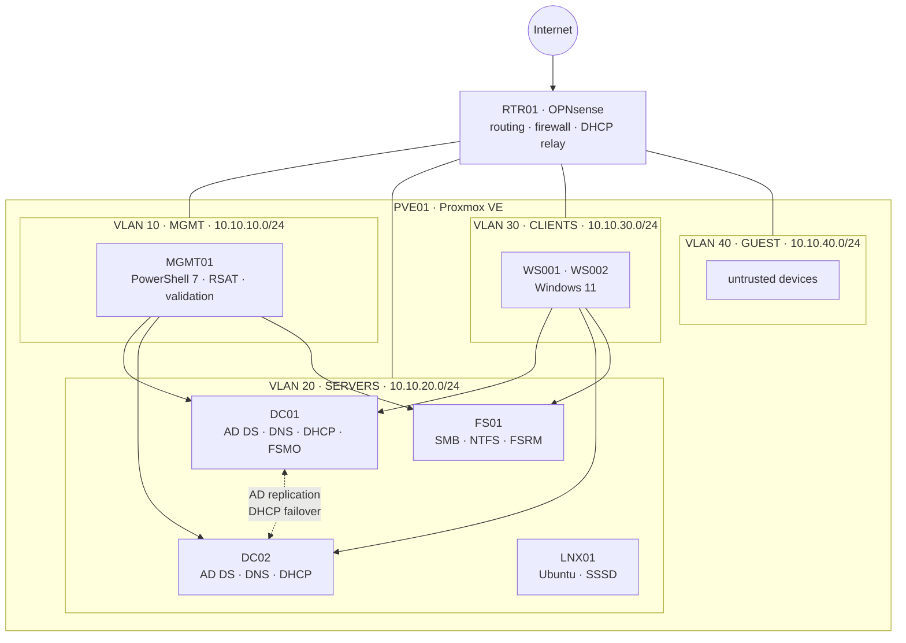

# nrw-corp-lab

[](https://github.com/ATarasovHub/nrw-corp-lab/actions/workflows/lint.yml)
[](LICENSE)

**English** | [Deutsch](README.de.md)

A reproducible Windows Server 2025 corporate lab for a fictional 30-person NRW company, from Proxmox VMs to tested Active Directory, Group Policy, file services and recovery automation.

## Architecture



The router applies default-deny inter-VLAN policy. Two writable DCs provide redundant AD-integrated DNS and load-balanced DHCP; users and permissions are generated from data files; GPO, backup and validation are scripted end to end.

## Technology stack

| Layer | Technology | Use in this project |
| ----- | ---------- | ------------------- |
| Virtualization | Proxmox VE 8 | VLAN-aware bridge and lab VMs |
| Images / IaC | Packer, Terraform (`bpg/proxmox`) | Unattended Server 2025 templates and VM lifecycle |
| Network edge | OPNsense | Routing, stateful firewall, DHCP relay, upstream DNS |
| Identity | Windows Server 2025 AD DS | Two DCs, DNS, Recycle Bin, sites, tiered administration |
| Addressing | Windows DHCP | 50/50 failover, secure dynamic DNS, reservations |
| Policy | Group Policy, Windows LAPS | Passwords, baseline, updates, drive maps, local-admin control |
| Storage | SMB, NTFS, FSRM | AGDLP ACLs, access-based enumeration, quotas, home folders |
| Recovery | Windows Server Backup, `ntdsutil` | System State, volume backup, IFM and a restore-test runbook |
| Automation | PowerShell 7 | Idempotent scripts with `-WhatIf`; desired state in `data/` |
| Quality | Pester, PSScriptAnalyzer, GitHub Actions | Unit tests, live integration checks and static analysis |

## Quick start

Prerequisites: a Proxmox VE 8 node with at least 32 GB RAM, VLAN-aware `vmbr1`, internet-facing `vmbr0`, Windows Server 2025/VirtIO/OPNsense ISOs, Packer 1.11+, Terraform 1.6+ and PowerShell 7. Full details are in [Infrastructure](infra/README.md).

1. Clone the repository and build the Core and Desktop Experience templates.

   ```bash
   git clone https://github.com/ATarasovHub/nrw-corp-lab.git
   cd nrw-corp-lab/infra/packer/windows-server-2025
   cp windows-server-2025.pkrvars.hcl.example windows-server-2025.pkrvars.hcl
   export PKR_VAR_proxmox_token='<token secret>'
   export PKR_VAR_admin_password='<build password>'
   packer init .
   packer build -var-file=windows-server-2025.pkrvars.hcl -var edition=core .
   packer build -var-file=windows-server-2025.pkrvars.hcl -var edition=desktop .
   ```

2. Provision the VMs, initially leaving DHCP clients stopped.

   ```bash
   cd ../../terraform
   cp terraform.tfvars.example terraform.tfvars
   export PROXMOX_VE_API_TOKEN='terraform@pve!terraform=<secret>'
   export TF_VAR_windows_admin_password='<local admin password>'
   terraform init
   terraform plan -out tfplan
   terraform apply tfplan
   ```

3. Install and configure RTR01: VLAN interfaces, default-deny firewall rules, DHCP relay and Unbound. Use the exact plan in [02 — Network](docs/02-network.md).

4. From an elevated PowerShell 7 session, create the forest on DC01 and add DC02.

   ```powershell
   # DC01 (run again after reboot without the password parameter)
   .\scripts\Domain\Initialize-Domain.ps1 -SafeModeAdministratorPassword (Read-Host -AsSecureString) -Restart
   .\scripts\Domain\Initialize-Domain.ps1
   .\scripts\Domain\Set-DnsConfiguration.ps1

   # DC02
   .\scripts\Domain\Add-ReplicaDomainController.ps1 -Credential (Get-Credential NRWCORP\Administrator) -SafeModeAdministratorPassword (Read-Host -AsSecureString) -Restart
   .\scripts\Domain\Add-ReplicaDomainController.ps1 -Credential (Get-Credential NRWCORP\Administrator)
   ```

5. Create the OU/group/user model, join member servers, deploy DHCP, then start and join WS001/WS002.

   ```powershell
   # DC01
   .\scripts\Directory\New-AdOuStructure.ps1
   .\scripts\Directory\Import-LabUsers.ps1
   .\scripts\Network\New-DhcpScopes.ps1 -FailoverSharedSecret (Read-Host -AsSecureString)
   ```

   Set `start_clients = true`, apply Terraform again, then use `Join-LabDomain.ps1` on FS01, MGMT01 and the workstations. The complete host-by-host order is in [scripts/README.md](scripts/README.md).

6. Deploy file services and Group Policy, then export the live GPOs.

   ```powershell
   # FS01
   .\scripts\FileServer\New-FileShares.ps1

   # DC01
   .\scripts\GroupPolicy\Set-FineGrainedPasswordPolicy.ps1
   .\scripts\GroupPolicy\New-LabGpo.ps1
   .\scripts\GroupPolicy\Export-LabGpo.ps1
   ```

7. Back up each Windows infrastructure server to dedicated media and validate from MGMT01.

   ```powershell
   # DC01, DC02 and FS01
   .\scripts\Backup\Backup-LabEnvironment.ps1 -BackupTarget E:

   # MGMT01
   .\scripts\Validation\Invoke-LabValidation.ps1
   ```

Secrets are parameters or environment variables only. Never commit `terraform.tfstate`, `*.tfvars`, generated credentials, backup media or transcripts.

## Design decisions

- **Two DCs, one domain.** Authentication, DNS and DHCP survive a DC reboot without adding multi-domain complexity.
- **Segmentation before services.** MGMT, SERVERS, CLIENTS and GUEST have different trust levels; RTR01 permits only documented flows.
- **Server Core by default.** DCs and FS01 have a smaller attack and patch surface; administration stays on MGMT01.
- **AGDLP for authorization.** Users enter global role groups, which enter domain-local resource groups, and only resource groups appear on ACLs.
- **Small, single-purpose GPOs.** Default policies remain untouched; each custom GPO has a documented scope and can be exported/restored independently.
- **Desired state plus observed-state tests.** CSV/PSD1 files describe intent; Pester also checks live replication, a real DHCP lease, RSoP and exact NTFS ACLs.
- **Backups are not recovery proof.** System State is the recovery source, IFM is only a rebuild accelerator, and RT-01 records an isolated restore test.

The full context and consequences are in [01 — Architecture](docs/01-architecture.md#design-decisions).

## Validation

Unit tests run in GitHub Actions. Live tests run only inside the lab:

```powershell
Invoke-Pester -Path .\tests\Unit
.\scripts\Validation\Invoke-LabValidation.ps1 -OutputPath C:\TestResults\integration.xml
```

See [06 — Validation](docs/06-validation.md) for prerequisites and failure interpretation. Deployment evidence is tracked in [docs/screenshots](docs/screenshots/README.md); only screenshots of completed results belong there.

## Limitations

- This is a learning/reference lab, not a supported production blueprint or a substitute for a security assessment.
- PVE01 and its storage remain a single point of failure; DC redundancy does not make the hypervisor highly available.
- OPNsense installation and firewall entry are documented but not yet automated.
- No AD CS, Entra ID, Exchange, SIEM/EDR, monitoring platform, WSUS or centralized secrets vault is included.
- Clients update directly from Microsoft; server installation still requires a maintenance window.
- Backup retention depends on external storage. The RT-01 result must stay **pending** until a real isolated restore has passed.
- Live `Backup-GPO` exports, JUnit evidence and 5–8 result screenshots cannot exist before the lab is deployed; the repository does not fabricate them.
- Evaluation media and all Microsoft/OPNsense licensing remain the operator's responsibility.

## Documentation

| Document | Content |
| -------- | ------- |
| [01 — Architecture](docs/01-architecture.md) | Topology, inventory and ADR-style decisions |
| [02 — Network](docs/02-network.md) | VLANs, IP plan, DNS, DHCP and firewall policy |
| [03 — AD Design](docs/03-ad-design.md) | OU model, naming, AGDLP and admin tiers |
| [04 — Group Policy](docs/04-gpo.md) | Every GPO setting, rationale, export and restore |
| [05 — Backup and Restore](docs/05-backup-restore.md) | Recovery objectives, runbooks and RT-01 |
| [06 — Validation](docs/06-validation.md) | Unit/live Pester tests and JUnit evidence |
| [99 — Troubleshooting](docs/99-troubleshooting.md) | Symptom-led diagnostics and known issues |
| [Infrastructure](infra/README.md) | Packer templates and Terraform deployment |
| [Scripts](scripts/README.md) | Exact host-by-host execution order |

## Repository layout

```text
.github/workflows/  static analysis, unit tests, Terraform and Packer validation
data/               desired-state OUs, users, groups, DHCP, shares, GPO and probes
docs/               architecture, operations, recovery and troubleshooting
gpo/                versioned Backup-GPO exports after a live deployment
infra/              Packer, Terraform and cloud-init
scripts/            PowerShell 7 deployment, backup and validation entry points
tests/               CI unit tests and live integration tests
```

## License

[MIT](LICENSE)
