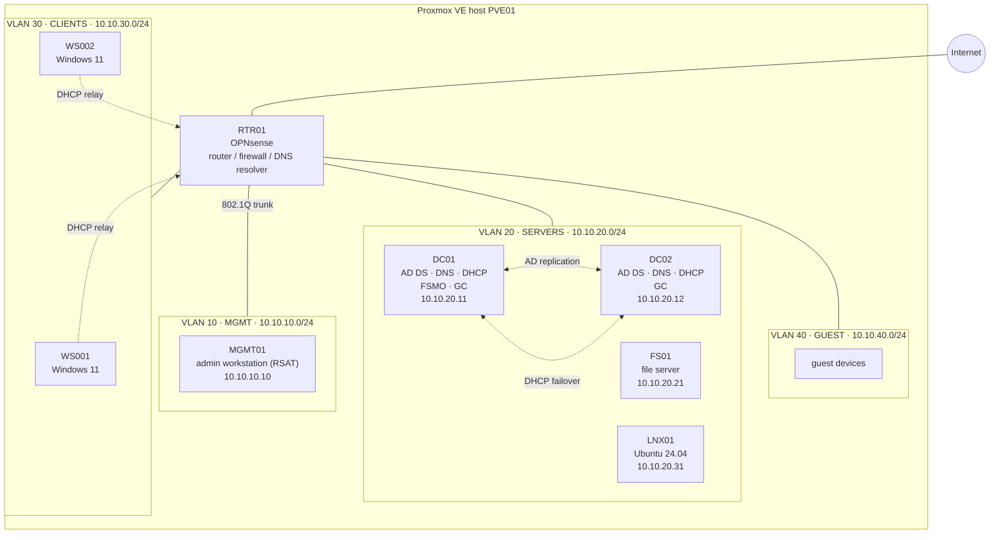

# 01 — Architecture

This document describes the target architecture of **nrw-corp-lab**: a Windows Server 2025 /
Active Directory Domain Services environment for *NRW Corp GmbH*, a fictional 30-employee company
based in Düsseldorf, North Rhine-Westphalia. Everything described here is deployed as code from
this repository.

Related documents:

- [02 — Network](02-network.md): VLANs, IP plan, DHCP, DNS
- [03 — AD Design](03-ad-design.md): OU structure, naming conventions, AGDLP

## Goals and Non-Goals

**Goals**

- Reproducible deployment: tearing the lab down and rebuilding it yields the same result.
- Idempotent automation: every script can be re-run safely.
- Realistic small-business design that follows Microsoft and BSI IT-Grundschutz recommendations
  where they make sense at this scale.
- No secrets in the repository.

**Non-Goals**

- Multi-site or multi-domain topologies.
- Hybrid identity (Entra ID Connect), Exchange, PKI (AD CS) — possible future extensions.
- Production-grade high availability of the hypervisor itself.

## Topology

All lab VMs are attached to one VLAN-aware Linux bridge (`vmbr1`). Each VM network adapter is
tagged with its VLAN ID; RTR01 receives a trunk carrying all VLANs and is the only device that routes between
them. Inter-VLAN traffic is therefore always subject to firewall rules
(see [02 — Network](02-network.md#inter-vlan-firewall-policy)). RTR01's WAN interface sits on a
second bridge (`vmbr0`) with upstream connectivity.

## Component Inventory

| Host   | Role                                      | OS                                  | VLAN | vCPU | RAM   | Disk   |
| ------ | ----------------------------------------- | ----------------------------------- | ---- | ---- | ----- | ------ |
| PVE01  | Hypervisor (physical)                     | Proxmox VE 8                        | 10   | —    | ≥32 GB | ≥500 GB SSD |
| RTR01  | Router, firewall, DNS resolver, DHCP relay | OPNsense                           | all  | 2    | 2 GB  | 20 GB  |
| DC01   | AD DS, DNS, DHCP, all FSMO roles, GC      | Windows Server 2025 Standard (Core) | 20   | 2    | 3 GB  | 60 GB  |
| DC02   | AD DS, DNS, DHCP (failover partner), GC   | Windows Server 2025 Standard (Core) | 20   | 2    | 3 GB  | 60 GB  |
| FS01   | File server (departmental shares)         | Windows Server 2025 Standard (Core) | 20   | 2    | 3 GB  | 60 GB + 100 GB data |
| LNX01  | Linux member server (SSSD, monitoring)    | Ubuntu Server 24.04 LTS             | 20   | 2    | 2 GB  | 32 GB  |
| MGMT01 | Admin workstation, RSAT, GPMC             | Windows Server 2025 (Desktop Exp.)  | 10   | 2    | 4 GB  | 60 GB  |
| WS001  | Domain-joined client                      | Windows 11 Enterprise (eval)        | 30   | 2    | 4 GB  | 64 GB  |
| WS002  | Domain-joined client                      | Windows 11 Enterprise (eval)        | 30   | 2    | 4 GB  | 64 GB  |

Total guest footprint: 16 vCPU, ~25 GB RAM. The 30 employees exist as AD objects; two client
VMs are enough to demonstrate logon, GPO application and share access.

## Design Decisions

Each decision is recorded in a short ADR-style format: context, decision, consequences.

### D1 — Two domain controllers

**Context.** A single DC is a single point of failure for authentication, DNS and DHCP. When it
is down — including during every monthly patch reboot — nobody can log on to new sessions,
resolve names or obtain an IP address.

**Decision.** Deploy two writable DCs, DC01 and DC02, in the same site. Both run DNS
(AD-integrated zones) and are Global Catalog servers. DHCP runs on both in failover mode.

**Consequences.**

- Either DC can be patched, rebooted or even rebuilt without user impact.
- AD, DNS and DHCP are redundant with no extra infrastructure.
- Replication can be observed and tested (`repadmin /replsummary`), which is a core
  operational skill.
- A failed DC can be recovered by re-promoting instead of restoring from backup
  (backups are still required for forest recovery).
- Cost: one additional VM (~3 GB RAM). Accepted.

All five FSMO roles stay on DC01. In a single-domain forest where every DC is a GC, splitting
roles adds no benefit and makes troubleshooting harder. DC01 holds the PDC emulator role and is
therefore the authoritative time source for the domain.

### D2 — Network segmentation with VLANs

**Context.** A flat network lets every device talk to every other device. A compromised
workstation could reach DC management interfaces, the hypervisor or other clients directly.
BSI IT-Grundschutz (module NET.1.1) requires segmenting networks by protection requirement.

**Decision.** Split the network into four VLANs by function and trust level:

| VLAN | Name    | Trust  | Purpose                                             |
| ---- | ------- | ------ | --------------------------------------------------- |
| 10   | MGMT    | High   | Administration: admin workstation, hypervisor, router management |
| 20   | SERVERS | High   | Domain controllers and member servers               |
| 30   | CLIENTS | Medium | Employee workstations                               |
| 40   | GUEST   | None   | Visitors — internet access only                     |

RTR01 routes between VLANs with a default-deny policy; only explicitly required flows are allowed.

**Consequences.**

- Lateral movement is limited: clients reach servers only on the ports AD, DNS and SMB need,
  and cannot reach the management VLAN at all.
- Administration happens only from MGMT01 in VLAN 10, which supports the tiered admin model
  in [03 — AD Design](03-ad-design.md#administrative-tiering).
- Guest devices are fully isolated from corporate resources and use public DNS.
- Broadcast domains are small; DHCP for clients requires a relay on RTR01.
- Cost: an extra router VM and firewall rules to maintain. Accepted — this is the most
  important security control in a small network.

### D3 — Server Core for infrastructure servers

**Decision.** DCs and FS01 run Server Core; only MGMT01 has a GUI.

**Consequences.** Smaller attack surface, fewer patches and reboots, lower RAM usage.
Forces remote administration via PowerShell / RSAT, which is exactly what this project
automates anyway.

### D4 — Domain name `ad.nrwcorp.internal`

**Context.** Using a public domain one does not own risks name collisions; `.local` conflicts
with mDNS.

**Decision.** Use `ad.nrwcorp.internal` (NetBIOS: `NRWCORP`). ICANN reserved the `.internal`
TLD for private use in 2024, so it will never be delegated publicly.

**Consequences.** No collisions with the internet. A publicly routable UPN suffix can be added
later if hybrid identity is introduced.

### D5 — OPNsense as router and firewall

**Decision.** Use OPNsense (open source, FreeBSD-based) for routing, stateful firewalling,
DHCP relay and an upstream DNS resolver (Unbound with DNS over TLS).

**Consequences.** Real firewall semantics (aliases, per-interface rules, logging) instead of
Windows RRAS. Egress DNS is centralized: only RTR01 talks to public resolvers.

### D6 — Windows DHCP with failover instead of router DHCP

**Decision.** Corporate VLANs get addresses from Windows DHCP on DC01/DC02 in load-balance
failover (50/50). The GUEST VLAN is served by RTR01's own DHCP.

**Consequences.** DHCP registers client records in AD-integrated DNS (secure dynamic updates)
and survives the loss of one DC. Guest DHCP stays outside the domain entirely.

### D7 — Automation approach

**Decision.** PowerShell 7 scripts in `scripts/`, one concern per script, each idempotent and
supporting `-WhatIf`. Desired state (OUs, groups, users, shares) lives as data in `data/`, not
hard-coded in scripts. VM provisioning is kept separate in `infra/`.

**Consequences.** Configuration changes are data changes that can be reviewed in a pull
request. Scripts are linted with PSScriptAnalyzer and tested with Pester in CI.

### D8 — Proxmox VE, Packer and Terraform

**Context.** The lab must be rebuildable from scratch without clicking through installers.

**Decision.** Run the lab on Proxmox VE. Packer builds sysprepped Windows Server 2025
templates (Core and Desktop Experience) from the official ISO with an `autounattend.xml`;
Terraform (`bpg/proxmox` provider) clones them and creates all VMs. Per-VM settings — hostname,
static IP, DNS servers, Administrator password — are passed through the Proxmox cloud-init drive
and applied by Cloudbase-Init on Windows and cloud-init on Ubuntu.

**Consequences.**

- One command per layer: `packer build` for images, `terraform apply` for VMs.
- Templates are immutable; configuration drift is fixed by rebuilding, not patching by hand.
- Proxmox is free, supports VLAN-aware bridges and has a mature Terraform provider.
- OPNsense is still installed interactively from ISO; its configuration is documented instead.
- Details and usage: [infra/README.md](../infra/README.md).

### D9 — A Linux member server

**Decision.** Add LNX01 (Ubuntu 24.04 LTS, provisioned with cloud-init) to the SERVERS VLAN.

**Consequences.** Demonstrates that the AD design works for heterogeneous environments
(Kerberos, SSSD, DNS, time sync), which is the norm in German mid-sized companies. It is also
the natural host for monitoring in a later phase.

## Deployment Order

1. Host: Proxmox bridges; Packer builds the Windows templates, Terraform creates all VMs (`infra/`).
2. RTR01: VLAN interfaces, firewall rules, DHCP relay, DNS resolver.
3. DC01: network configuration, AD DS forest, DNS zones, DHCP.
4. DC02: promotion as additional DC, DHCP failover.
5. AD structure: OUs, groups, users, delegation (`data/`).
6. FS01: domain join, shares, NTFS permissions via AGDLP.
7. Group Policy (`gpo/`).
8. Backups: System State / IFM on DCs and volume backup on FS01 (`scripts/Backup/`).
9. Validation: live domain, replication, DHCP, RSoP and NTFS tests (`tests/Integration/`).
10. Evidence: run RT-01 and add 5–8 result screenshots (`docs/screenshots/`).
