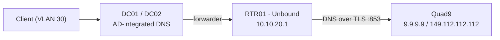

# 02 — Network

Network design for nrw-corp-lab. Rationale for segmentation is in
[01 — Architecture, D2](01-architecture.md#d2--network-segmentation-with-vlans).

## Addressing Scheme

- Supernet: **10.10.0.0/16**, one **/24 per VLAN**.
- The third octet equals the VLAN ID (`10.10.<vlan>.0/24`) — an address tells you its VLAN.
- The gateway is always **`.1`** (RTR01).
- Every /24 follows the same layout:

| Range         | Usage                                              |
| ------------- | -------------------------------------------------- |
| `.1`          | Default gateway (RTR01)                            |
| `.2` – `.9`   | Reserved for network infrastructure                |
| `.10` – `.49` | Static addresses (servers, appliances)             |
| `.50` – `.99` | DHCP reservations (printers, fixed devices)        |
| `.100` – `.199` | DHCP dynamic pool                                |
| `.200` – `.254` | Reserved for future use                          |

## VLANs

| VLAN | Name      | Subnet          | Gateway      | Addressing          | DHCP server        |
| ---- | --------- | --------------- | ------------ | ------------------- | ------------------ |
| 10   | MGMT      | 10.10.10.0/24   | 10.10.10.1   | Static only         | —                  |
| 20   | SERVERS   | 10.10.20.0/24   | 10.10.20.1   | Static only         | —                  |
| 30   | CLIENTS   | 10.10.30.0/24   | 10.10.30.1   | DHCP + reservations | DC01 / DC02 (failover), relayed by RTR01 |
| 40   | GUEST     | 10.10.40.0/24   | 10.10.40.1   | DHCP                | RTR01              |
| 999  | BLACKHOLE | —               | —            | —                   | —                  |

VLAN 999 is the native/default VLAN on the trunk and carries no traffic; untagged frames are dropped.
All lab VLANs share the VLAN-aware Proxmox bridge `vmbr1`. RTR01's WAN interface is attached to
`vmbr0` (untagged) and receives its address from the upstream network.

## Static Addresses

| Host   | VLAN | IP address   | Notes                                  |
| ------ | ---- | ------------ | -------------------------------------- |
| RTR01  | 10   | 10.10.10.1   | Gateway, web UI reachable only from MGMT |
| PVE01  | 10   | 10.10.10.5   | Proxmox VE host management interface   |
| MGMT01 | 10   | 10.10.10.10  | Admin workstation                      |
| RTR01  | 20   | 10.10.20.1   | Gateway                                |
| DC01   | 20   | 10.10.20.11  | AD DS, DNS, DHCP, PDC emulator         |
| DC02   | 20   | 10.10.20.12  | AD DS, DNS, DHCP                       |
| FS01   | 20   | 10.10.20.21  | File server                            |
| LNX01  | 20   | 10.10.20.31  | Ubuntu member server                   |
| RTR01  | 30   | 10.10.30.1   | Gateway, DHCP relay                    |
| RTR01  | 40   | 10.10.40.1   | Gateway, DHCP server for guests        |

## DHCP

### Scope `CLIENTS` (Windows DHCP, DC01 + DC02)

| Setting                | Value                                   |
| ---------------------- | --------------------------------------- |
| Scope                  | 10.10.30.0/24                           |
| Pool                   | 10.10.30.100 – 10.10.30.199 (100 leases) |
| Exclusions             | 10.10.30.1 – 10.10.30.99, 10.10.30.200 – 10.10.30.254 |
| Lease duration         | 8 days                                  |
| Option 3 — Router      | 10.10.30.1                              |
| Option 6 — DNS servers | 10.10.20.11, 10.10.20.12                |
| Option 15 — DNS domain | ad.nrwcorp.internal                     |
| Failover               | Load balance 50/50, MCLT 1 h, shared secret passed as `SecureString` |
| DNS dynamic updates    | Always, discard A/PTR on lease deletion, secure updates only |

The pool of 100 leases covers 30 employees with ~2 devices each plus headroom.
Both DHCP servers are authorized in AD. RTR01 relays DHCP requests from VLAN 30 to both
10.10.20.11 and 10.10.20.12.

### Scope `GUEST` (OPNsense, RTR01)

| Setting        | Value                          |
| -------------- | ------------------------------ |
| Pool           | 10.10.40.100 – 10.10.40.199    |
| Lease duration | 4 hours                        |
| Router         | 10.10.40.1                     |
| DNS servers    | 10.10.40.1 (Unbound on RTR01)  |

Guests never receive the internal DNS servers or domain name.

### Reservations (VLAN 30)

| Name   | IP address   | MAC address       | Purpose                     |
| ------ | ------------ | ----------------- | --------------------------- |
| PRN01  | 10.10.30.50  | set at deployment | Network printer, ground floor |
| PRN02  | 10.10.30.51  | set at deployment | Network printer, 1st floor  |

MAC addresses are supplied as script parameters, not stored in the repository.

## DNS

### Zones

| Zone                      | Type                          | Replication scope      | Dynamic updates |
| ------------------------- | ----------------------------- | ---------------------- | --------------- |
| `ad.nrwcorp.internal`     | Primary, AD-integrated        | All DNS servers in domain | Secure only  |
| `_msdcs.ad.nrwcorp.internal` | Primary, AD-integrated     | All DNS servers in forest | Secure only  |
| `10.10.10.in-addr.arpa`   | Reverse, AD-integrated        | All DNS servers in domain | Secure only  |
| `20.10.10.in-addr.arpa`   | Reverse, AD-integrated        | All DNS servers in domain | Secure only  |
| `30.10.10.in-addr.arpa`   | Reverse, AD-integrated        | All DNS servers in domain | Secure only  |

Aging and scavenging: enabled on all zones, no-refresh 7 days, refresh 7 days, scavenging on
DC01 only.

### Forwarders

| Setting                      | Value                                   |
| ---------------------------- | --------------------------------------- |
| Forwarder on DC01 / DC02     | 10.10.20.1 (Unbound on RTR01)           |
| Use root hints as fallback   | Disabled                                |
| Forwarder timeout            | 3 s                                     |
| Unbound upstream             | Quad9 over DNS over TLS (`dns.quad9.net`) |

Only RTR01 may send DNS traffic to the internet; outbound TCP/UDP 53 and 853 from all other
hosts is blocked. This makes DNS a single, observable egress point and prevents clients from
bypassing internal DNS. Quad9 is operated by a Swiss foundation and applies threat-intelligence
blocking, which is a sensible default for a German company under GDPR.

### DC DNS Client Settings

Following Microsoft guidance, each DC points to its partner first and to itself second — never
to itself alone, which can isolate a DC after a restart ("island" problem).

| DC   | Preferred DNS | Alternate DNS |
| ---- | ------------- | ------------- |
| DC01 | 10.10.20.12   | 127.0.0.1     |
| DC02 | 10.10.20.11   | 127.0.0.1     |

## Time Synchronization

- DC01 (PDC emulator) syncs from the PTB, Germany's national metrology institute:
  `ptbtime1.ptb.de`, `ptbtime2.ptb.de`, `ptbtime3.ptb.de`.
- All other domain members sync from the domain hierarchy (NT5DS).
- Firewall allows outbound UDP 123 from DC01 only.

## Inter-VLAN Firewall Policy

Default policy is **deny**. Rules are evaluated per source interface on RTR01; return traffic
of allowed sessions is permitted statefully.

| Source  | Destination   | Allowed                                                     |
| ------- | ------------- | ----------------------------------------------------------- |
| MGMT    | SERVERS       | Any (RDP, WinRM 5985/5986, SMB, RPC, AD ports)              |
| MGMT    | CLIENTS       | WinRM 5985/5986, RDP 3389                                   |
| MGMT    | Internet      | HTTP/HTTPS                                                  |
| SERVERS | SERVERS       | Any (same subnet, not routed)                               |
| SERVERS | RTR01         | DNS 53 (Unbound)                                            |
| SERVERS | Internet      | HTTP/HTTPS (Windows Update); NTP 123 from DC01 only         |
| CLIENTS | DC01, DC02    | DNS 53, Kerberos 88, kpasswd 464, NTP 123, LDAP 389, LDAPS 636, GC 3268/3269, SMB 445, RPC 135 + 49152–65535 |
| CLIENTS | FS01          | SMB 445                                                     |
| CLIENTS | Internet      | HTTP/HTTPS                                                  |
| CLIENTS | MGMT          | **Denied**                                                  |
| GUEST   | RTR01         | DHCP 67, DNS 53                                             |
| GUEST   | Internet      | HTTP/HTTPS                                                  |
| GUEST   | RFC 1918      | **Denied**                                                  |
| any     | MGMT          | **Denied** (except return traffic)                          |

The AD port list follows Microsoft's "How to configure a firewall for Active Directory domains
and trusts". The dynamic RPC range could later be restricted further by pinning AD replication
and Netlogon to fixed ports.
