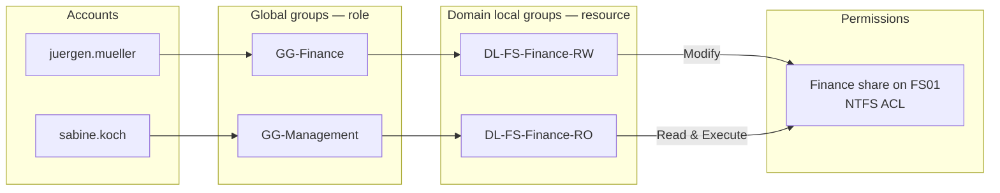

# 03 — Active Directory Design

Logical design of the `ad.nrwcorp.internal` domain: forest settings, OU structure, naming
conventions and the AGDLP permission model.

## Forest and Domain

| Setting                   | Value                                    |
| ------------------------- | ---------------------------------------- |
| Forest / domain           | Single forest, single domain             |
| DNS name                  | `ad.nrwcorp.internal`                    |
| NetBIOS name              | `NRWCORP`                                |
| Forest functional level   | Windows Server 2025                      |
| Domain functional level   | Windows Server 2025                      |
| Domain controllers        | DC01 (all FSMO roles, GC), DC02 (GC)     |
| Site                      | `NRW-Duesseldorf` (renamed from `Default-First-Site-Name`) |
| Site subnets              | 10.10.10.0/24, 10.10.20.0/24, 10.10.30.0/24 |
| AD Recycle Bin            | Enabled                                  |
| Default computer container | Redirected to `OU=Staging,OU=Computers,OU=NRW` (`redircmp`) |
| Default user container    | Redirected to `OU=Staging,OU=Users,OU=NRW` (`redirusr`) |

Redirecting the default containers matters because the built-in `CN=Users` and `CN=Computers`
containers are not OUs: Group Policy cannot be linked to them. New objects land in a staging OU
where a baseline policy applies until they are moved to their final location.

## OU Structure

All company objects live under one top-level OU, `NRW`. This keeps them separate from built-in
containers and allows delegating or linking policy to the whole company in one place.
The first level is split by **object type** (who manages it, which GPOs apply), the second by
**department** or **role**.

```text
ad.nrwcorp.internal
├── Domain Controllers                      (built-in, Tier 0)
└── NRW
    ├── Admin                               restricted — Tier 0 admins only
    │   ├── Tier0
    │   │   ├── Accounts                    t0a-* accounts
    │   │   └── Groups                      Tier 0 admin groups
    │   ├── Tier1
    │   │   ├── Accounts                    t1a-* accounts
    │   │   └── Groups
    │   └── Tier2
    │       ├── Accounts                    t2a-* accounts
    │       └── Groups
    ├── Users
    │   ├── Management
    │   ├── Finance
    │   ├── HR
    │   ├── Sales
    │   ├── Marketing
    │   ├── Operations
    │   ├── IT
    │   └── Staging                         default location for new users
    ├── Groups
    │   ├── Role                            GG-* global groups (who you are)
    │   └── Resource                        DL-* domain local groups (what you can access)
    ├── Computers
    │   ├── Workstations
    │   ├── Admin                           privileged access workstations (MGMT01)
    │   └── Staging                         default location for new computers
    ├── Servers
    │   ├── FileServers
    │   ├── LinuxServers                    SSSD-joined Linux hosts
    │   └── MemberServers
    ├── ServiceAccounts                     gMSAs
    └── Disabled
        ├── Users                           leavers, kept 90 days before deletion
        └── Computers
```

Design principles:

- **Users and computers are separated** so that user and computer GPOs can be linked
  independently and loopback processing is rarely needed.
- **Servers are separated from workstations** because they belong to different admin tiers
  and receive different baselines.
- **Department OUs** exist for delegation (e.g. HR may later manage their own users) and
  department-specific policies. Access to data is **not** derived from OU membership, only
  from groups.
- **Depth is at most four levels** below the domain to keep GPO inheritance easy to reason about.
- All OUs are created with *Protect from accidental deletion* enabled.

## Staffing

| Department | Employees | Role group          |
| ---------- | --------- | ------------------- |
| Management | 2         | `GG-Management`     |
| Finance    | 4         | `GG-Finance`        |
| HR         | 3         | `GG-HR`             |
| Sales      | 7         | `GG-Sales`          |
| Marketing  | 4         | `GG-Marketing`      |
| Operations | 6         | `GG-Operations`     |
| IT         | 4         | `GG-IT`             |
| **Total**  | **30**    |                     |

Each department additionally has a `GG-<Department>-Leads` group for team leads.
All employees are members of `GG-AllStaff` (via nesting of the department groups).

## Naming Conventions

### User Accounts

| Attribute           | Convention                                  | Example                          |
| ------------------- | ------------------------------------------- | -------------------------------- |
| `sAMAccountName`    | `firstname.lastname`, lowercase, ≤ 20 chars | `juergen.mueller`                |
| `userPrincipalName` | `<sAMAccountName>@ad.nrwcorp.internal`      | `juergen.mueller@ad.nrwcorp.internal` |
| `cn` / `name`       | `Firstname Lastname`                        | `Jürgen Müller`                  |
| `displayName`       | `Firstname Lastname`                        | `Jürgen Müller`                  |
| `givenName`, `sn`   | Original spelling including umlauts         | `Jürgen`, `Müller`               |
| `department`        | Department name                             | `Finance`                        |
| `title`             | Job title                                   | `Accountant`                     |
| `employeeID`        | `E` + 4 digits                              | `E1017`                          |

Rules for deriving the logon name:

1. Transliterate German characters: `ä → ae`, `ö → oe`, `ü → ue`, `ß → ss`; remove other
   diacritics (`é → e`).
2. Remove spaces and apostrophes; keep hyphens in double names (`anna-lena.schmitz`).
3. If longer than 20 characters (`sAMAccountName` limit), shorten the first name to its initial
   (`k.schulze-hoffmann`).
4. On collision, append a digit starting at 2 (`thomas.becker2`).

`employeeID` is the stable key used by the provisioning script to decide whether a user already
exists, so renames (e.g. after marriage) update the account instead of creating a duplicate.

### Administrative Accounts

Administrators use a **separate account per tier** and never use their standard account for
administration.

| Tier | Pattern                 | Example        | Scope                                |
| ---- | ----------------------- | -------------- | ------------------------------------ |
| 0    | `t0a-<initial><lastname>` | `t0a-jmueller` | Domain controllers, AD, identity   |
| 1    | `t1a-<initial><lastname>` | `t1a-jmueller` | Member servers (FS01)              |
| 2    | `t2a-<initial><lastname>` | `t2a-jmueller` | Workstations, helpdesk tasks       |

### Service Accounts

Group Managed Service Accounts only; no user accounts with static passwords as service accounts.

| Pattern          | Example        | Notes                                     |
| ---------------- | -------------- | ----------------------------------------- |
| `gmsa-<service>` | `gmsa-backup`  | ≤ 15 characters (NetBIOS limit, `$` added automatically) |

### Groups

| Type                  | Scope        | Pattern                               | Example                  |
| --------------------- | ------------ | ------------------------------------- | ------------------------ |
| Role group            | Global       | `GG-<Department>[-<Role>]`            | `GG-Finance`, `GG-Sales-Leads` |
| Resource group        | Domain local | `DL-<System>-<Resource>-<Permission>` | `DL-FS-Finance-RW`       |
| Admin role group      | Global       | `GG-T<tier>-<Role>`                   | `GG-T1-ServerAdmins`     |
| Delegation group      | Domain local | `DL-OU-<OU>-<Right>`                  | `DL-OU-Users-ResetPassword` |
| Universal group       | Universal    | `UG-<Name>`                           | not used in a single domain |

Permission suffixes: `RO` (read), `RW` (modify), `FC` (full control, admins only).
System prefixes: `FS` (file shares), `PRN` (printers), `OU` (AD delegation), `APP` (applications).
Every group has a `description` stating its purpose and, for DL groups, the resource path.

### Computers

NetBIOS names are limited to 15 characters.

| Type                  | Pattern      | Examples                 |
| --------------------- | ------------ | ------------------------ |
| Server                | `<ROLE><nn>` | `DC01`, `DC02`, `FS01`   |
| Linux server          | `LNX<nn>`    | `LNX01`                  |
| Admin workstation     | `MGMT<nn>`   | `MGMT01`                 |
| Employee workstation  | `WS<nnn>`    | `WS001`, `WS002`         |
| Printer               | `PRN<nn>`    | `PRN01`                  |

### Group Policy Objects

Pattern: `<Target>-<Scope>-<Purpose>` where target is `C` (computer settings) or `U` (user
settings) — e.g. `C-WS-SecurityBaseline`, `U-All-DriveMappings`, `C-DC-AuditPolicy`.
A GPO configures either computer or user settings, never both; the unused half is disabled.

## Permission Model: AGDLP

Permissions are granted using **AGDLP**:
**A**ccounts go into **G**lobal groups, global groups go into **D**omain **L**ocal groups,
and domain local groups receive **P**ermissions.



Rules:

1. **Users are never placed on an ACL** — not on NTFS, shares, printers or delegation.
2. **Global groups are never placed on an ACL** — they describe *who* someone is (role).
3. **Only domain local groups are placed on ACLs** — they describe *what* can be accessed.
4. Each resource has at most one DL group per permission level (`RO`, `RW`, `FC`).
5. Share permissions are `Authenticated Users: Change`; effective access is controlled by NTFS.
6. Access-based enumeration is enabled so users only see folders they can open.

Why AGDLP instead of assigning users directly:

- **Auditability.** "Who can access Finance?" is answered by the members of one DL group;
  "What can Finance staff access?" by the `memberOf` of one GG group.
- **Onboarding and offboarding** become a single group change — moving a user to a new
  department grants and revokes all related access consistently.
- **ACLs stay stable.** NTFS permissions are set once; changes happen in AD, avoiding slow
  recursive ACL rewrites on large file trees.
- **Scales to multiple domains.** Global groups can be nested into domain local groups of a
  trusting domain, so the model survives a future merger or second domain.

### Share Access Matrix

| Share                | `DL-*-RW` members                   | `DL-*-RO` members                 |
| -------------------- | ----------------------------------- | --------------------------------- |
| `\\FS01\Management`  | `GG-Management`                     | —                                 |
| `\\FS01\Finance`     | `GG-Finance`                        | `GG-Management`                   |
| `\\FS01\HR`          | `GG-HR`                             | `GG-Management`                   |
| `\\FS01\Sales`       | `GG-Sales`                          | `GG-Management`, `GG-Marketing`   |
| `\\FS01\Marketing`   | `GG-Marketing`                      | `GG-Management`, `GG-Sales`       |
| `\\FS01\Operations`  | `GG-Operations`                     | `GG-Management`, `GG-Sales`       |
| `\\FS01\IT`          | `GG-IT`                             | —                                 |
| `\\FS01\Public`      | `GG-AllStaff`                       | —                                 |

`DL-FS-<Share>-FC` contains only `GG-T1-ServerAdmins`.

## Administrative Tiering

The lab applies a simplified version of Microsoft's enterprise access model:

| Tier | Assets                                  | Admin group            | May log on to               |
| ---- | --------------------------------------- | ---------------------- | --------------------------- |
| 0    | DC01, DC02, AD, Group Policy            | `GG-T0-DomainAdmins` (member of `Domain Admins`) | DCs, MGMT01 |
| 1    | FS01 and other member servers           | `GG-T1-ServerAdmins`   | Member servers, MGMT01      |
| 2    | Workstations, helpdesk                  | `GG-T2-Helpdesk`       | Workstations                |

- Logon restrictions are enforced with GPO user rights (*Deny log on locally / through RDP*)
  so that higher-tier credentials are never exposed on lower-tier machines.
- Tier 0 accounts are members of **Protected Users** (no NTLM, no delegation, no cached
  credentials, 4-hour TGT).
- The built-in `Administrator` account is renamed, given a long random password and used only
  for break-glass recovery.
- Local administrator passwords are managed by **Windows LAPS** (built into Server 2025 and
  Windows 11), stored encrypted in AD.

## Password Policy

| Policy                    | Applies to       | Min length | History | Max age | Lockout |
| ------------------------- | ---------------- | ---------- | ------- | ------- | ------- |
| Default Domain Policy     | All users        | 14         | 24      | none    | 10 attempts / 15 min |
| FGPP `PSO-Admins`         | `GG-T*-*` admin groups | 20   | 24      | none    | 5 attempts / 30 min  |
| FGPP `PSO-ServiceAccounts` | Legacy service accounts (if any) | 30 | 24 | none | none |

No forced periodic password expiry, in line with current NIST SP 800-63B and BSI guidance;
passwords are changed on indication of compromise.
