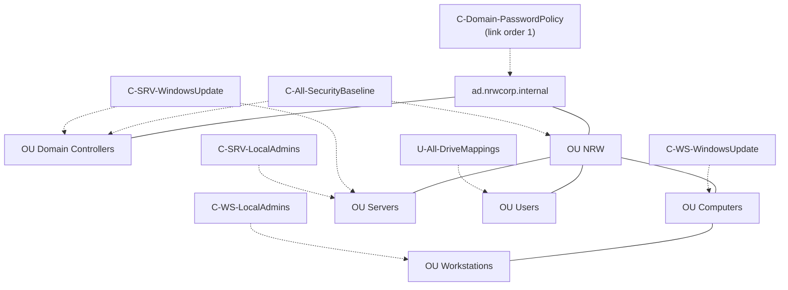
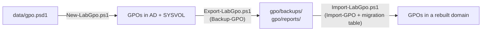

# 04 — Group Policy

Group Policy design for `ad.nrwcorp.internal`: which GPOs exist, where they are linked and why
each setting is there. The desired state is [data/gpo.psd1](../data/gpo.psd1); the scripts are in
[scripts/GroupPolicy](../scripts/GroupPolicy).

## Principles

- **One purpose per GPO.** Small GPOs are easier to troubleshoot (`gpresult`) and to delegate
  than one large "company policy".
- **Computer or user, never both.** The unused half of every GPO is disabled, which also speeds
  up processing (docs/03-ad-design.md#group-policy-objects).
- **Naming:** `<C|U>-<Scope>-<Purpose>` — `C` = computer settings, `U` = user settings.
- **Default Domain Policy and Default Domain Controllers Policy stay untouched.** Changes live in
  own GPOs that can be exported, reviewed and restored.
- **Code first.** GPOs are built from data by `New-LabGpo.ps1` and versioned as `Backup-GPO`
  exports in [gpo/](../gpo/). No setting is clicked in GPMC.

## Overview



| GPO | Linked to | Half | Purpose |
| --- | --------- | ---- | ------- |
| `C-Domain-PasswordPolicy` | Domain root (order 1) | Computer | Password and lockout policy for all domain accounts |
| `C-All-SecurityBaseline` | `NRW`, `Domain Controllers` | Computer | Protocol hardening, firewall, logging, Windows LAPS |
| `C-WS-WindowsUpdate` | `NRW/Computers` | Computer | Automatic update installation on clients |
| `C-SRV-WindowsUpdate` | `NRW/Servers`, `Domain Controllers` | Computer | Download and notify on servers |
| `C-WS-LocalAdmins` | `NRW/Computers/Workstations` | Computer | Local Administrators membership, tier separation |
| `C-SRV-LocalAdmins` | `NRW/Servers` | Computer | Local Administrators membership, tier separation |
| `U-All-DriveMappings` | `NRW/Users` | User | Department and public drive mappings |

Fine-grained password policies (PSOs) complement the domain policy; they are AD objects, not
GPOs, and are managed by `Set-FineGrainedPasswordPolicy.ps1`
([data/password-policies.psd1](../data/password-policies.psd1)).

## C-Domain-PasswordPolicy

| Setting | Value | Why |
| ------- | ----- | --- |
| Minimum password length | 14 | Length is the strongest factor against guessing; 14 is the maximum GPO value that older clients accept and matches the Microsoft baseline |
| Password history | 24 | Prevents cycling back to old passwords |
| Maximum password age | never | NIST SP 800-63B and BSI (ORP.4) no longer recommend periodic changes; they lead to predictable patterns. Passwords change on indication of compromise |
| Minimum password age | 1 day | Stops users from cycling through the history in one go |
| Complexity | enabled | Blocks the most trivial passwords |
| Reversible encryption | disabled | Would store passwords in a recoverable form |
| Lockout threshold / window / duration | 10 attempts / 15 min / 15 min | Slows down online guessing without letting an attacker lock out everyone permanently |

Password policy for domain accounts is only read from GPOs **linked to the domain root**.
Linking this GPO with order 1 makes it win over the Default Domain Policy without editing it.
Admin accounts get stricter values through `PSO-Admins` (20 characters, 5 attempts).

## C-All-SecurityBaseline

A lean subset of the Microsoft Security Baseline for Windows Server 2025 / Windows 11, focused on
settings that stop common attack paths in AD environments.

| Setting | Why |
| ------- | --- |
| LLMNR disabled (`EnableMulticast = 0`) | LLMNR answers name lookups from anyone on the subnet; tools like Responder abuse it to capture NTLM hashes |
| NTLMv2 only (`LmCompatibilityLevel = 5`) | Refuses LM and NTLMv1, whose hashes can be cracked or relayed trivially |
| LSA protection (`RunAsPPL = 1`) | Runs LSASS as protected process; blocks credential dumping by non-protected code |
| WDigest off (`UseLogonCredential = 0`) | Prevents clear-text credentials in LSASS memory |
| SMB signing required (client and server) | Prevents SMB relay and tampering |
| PowerShell script block logging | Records executed PowerShell code (event 4104) for incident response |
| Windows Firewall on for all profiles | Defense in depth next to the VLAN firewall on RTR01 |
| **Windows LAPS**: backup to AD, encrypted, 20 characters, 30 days | Every computer gets a unique, rotating local Administrator password. Without it, one leaked local password opens every machine (lateral movement). On DCs the same policy manages the DSRM password |

`New-LabGpo.ps1` extends the schema for Windows LAPS and grants the computer accounts in
`NRW/Computers` and `NRW/Servers` permission to write their password. Retrieve a password with
`Get-LapsADPassword -Identity WS001 -AsPlainText` (Tier 0/1 only).

## C-WS-WindowsUpdate and C-SRV-WindowsUpdate

| | Workstations | Servers and DCs |
| - | ------------ | --------------- |
| Mode | `AUOptions = 4`: download and install automatically | `AUOptions = 3`: download, notify |
| Schedule | every day, 03:00 | — |
| Reboot | not while a user is logged on | admin decides |

Clients should never lag behind on patches, so they install unattended. Servers — especially
the two DCs — are patched in a maintenance window, one DC at a time, so that authentication and
DNS stay available (this is one reason for having two DCs, see
[01 — Architecture, D1](01-architecture.md#d1--two-domain-controllers)). A WSUS or Azure Update
Manager setup is out of scope for the lab.

## C-WS-LocalAdmins and C-SRV-LocalAdmins

Implements "no local admin rights for users" and the tier model from
[03 — AD Design](03-ad-design.md#administrative-tiering).

| | Workstations | Member servers |
| - | ------------ | -------------- |
| Local Administrators (Restricted Groups, replaces all members) | built-in Administrator, `GG-T2-Helpdesk`, Domain Admins | built-in Administrator, `GG-T1-ServerAdmins`, Domain Admins |
| Deny log on locally / through RDP | `GG-T0-DomainAdmins`, `GG-T1-ServerAdmins` | `GG-T0-DomainAdmins`, `GG-T2-Helpdesk` |

- **Restricted Groups replace the membership on every refresh.** A user who was made local admin
  "just for this one installation" loses the right at the next policy refresh (90 minutes).
- The built-in Administrator cannot be removed from the group; its password is managed by LAPS.
- **Deny logon rights** keep higher-tier credentials off lower-tier machines, so that a
  compromised workstation cannot harvest a Domain Admin's credentials from memory.
- *Lab trade-off:* the built-in **Domain Admins** group stays a local admin and is not denied, so
  that the bootstrap scripts (run as `NRWCORP\Administrator`) keep working. In production,
  day-to-day administration would use only the `t0a-/t1a-/t2a-` accounts and Domain Admins would
  be denied as well.
- Domain controllers are intentionally not covered: their Administrators group is the domain's
  built-in Administrators group.

## U-All-DriveMappings

Group Policy Preferences drive maps with item-level targeting by security group:

| Drive | Target | Condition |
| ----- | ------ | --------- |
| `P:` | `\\FS01\Public` | member of `GG-AllStaff` |
| `G:` | `\\FS01\<Department>` | member of `GG-<Department>` |
| `H:` | `\\FS01\Home$\<sAMAccountName>` | AD attribute `homeDrive` (set by `New-FileShares.ps1`) |

- The same letter `G:` always means "my department", which keeps support and documentation simple.
- Targeting uses the **role groups**, not the OU, so moving a user between departments changes the
  mapping and the access rights with one group change.
- Mappings only make shares convenient; access is still decided by NTFS
  ([AGDLP](03-ad-design.md#permission-model-agdlp)).

## Export and Restore



| Script | What it does |
| ------ | ------------ |
| `New-LabGpo.ps1` | Builds/updates GPOs from `data/gpo.psd1`, prepares LAPS, creates links |
| `Export-LabGpo.ps1` | `Backup-GPO` of every lab GPO into `gpo/backups/<Name>/` (one current backup each) plus an HTML report in `gpo/reports/` |
| `Import-LabGpo.ps1` | `Import-GPO` from the backups into the current domain, creates links |
| `Set-FineGrainedPasswordPolicy.ps1` | PSOs for admin and service accounts |

A rebuilt domain has new SIDs. `Import-LabGpo.ps1` therefore generates a **migration table**
from the principals in each backup's report and maps them to the same names in the new domain.
Migration tables do not cover Group Policy Preferences, so the group SIDs in the drive-map
targeting are re-resolved by name after the import.

## Verification

```powershell
gpupdate /force
gpresult /r /scope computer          # applied computer GPOs
gpresult /h C:\Temp\rsop.html        # full report
Get-GPResultantSetOfPolicy -Computer WS001 -User NRWCORP\julia.fischer -ReportType Html -Path C:\Temp\ws001.html
```

The Pester suite (`tests/Integration/Gpo.Tests.ps1`) checks links and the resultant set of policy
automatically.

## Limitations

- Only a subset of the Microsoft Security Baseline is applied. For production, import the full
  baseline from the Microsoft Security Compliance Toolkit and document deviations.
- No WSUS: clients update directly from Microsoft Update.
- Registry settings outside `Policies` keys (for example `LmCompatibilityLevel`) are written as
  preferences and stay on the machine if the GPO is removed ("tattooing"), as in the official
  baseline.
