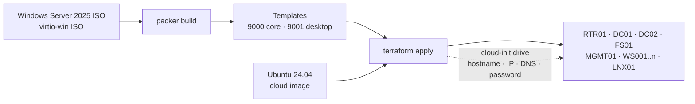

# Infrastructure

VM provisioning for nrw-corp-lab on **Proxmox VE**. Design rationale:
[docs/01-architecture.md — D8](../docs/01-architecture.md#d8--proxmox-ve-packer-and-terraform).

```text
infra/
├── packer/windows-server-2025/     Windows Server 2025 templates (Core + Desktop Experience)
│   ├── windows-server-2025.pkr.hcl   source + build
│   ├── variables.pkr.hcl
│   ├── templates/autounattend.xml.pkrtpl
│   ├── scripts/                      bootstrap scripts run inside the build VM
│   └── files/cloudbase-init/         Cloudbase-Init config + first-boot scripts
├── cloud-init/
│   └── ubuntu-user-data.yaml.tftpl   Ubuntu baseline (users, packages, time sync)
└── terraform/                        all lab VMs (bpg/proxmox provider)
```

## How It Fits Together



1. **Packer** installs Windows unattended from the ISO, installs VirtIO drivers, the QEMU guest
   agent, PowerShell 7 and Cloudbase-Init, then generalizes the VM with sysprep and converts it
   into a template.
2. **Terraform** full-clones the templates, sets CPU/RAM/disks/VLAN per role and writes a
   cloud-init drive. On first boot Cloudbase-Init (Windows) or cloud-init (Ubuntu) applies
   hostname, static IP, DNS servers and credentials.

## Prerequisites

| Item | Notes |
| ---- | ----- |
| Proxmox VE 8.x | Single node is enough (≥ 32 GB RAM for the full lab) |
| `vmbr0` | Bridge with upstream/internet access (router WAN, Packer build network with DHCP) |
| `vmbr1` | **VLAN-aware** bridge for the lab VLANs (`bridge-vlan-aware yes`) |
| Storage `local` | Content types `iso` and `snippets` enabled |
| ISOs on `local` | Windows Server 2025 (evaluation is fine), [virtio-win](https://github.com/virtio-win/virtio-win-pkg-scripts) ≥ 0.1.266, OPNsense DVD image |
| API tokens | One for Packer, one for Terraform, with VM/datastore privileges ([bpg docs](https://registry.terraform.io/providers/bpg/proxmox/latest/docs#authentication)) |
| SSH | Key-based SSH to the node via `ssh-agent` (Terraform uploads snippets over SSH) |
| Tools | Packer ≥ 1.11, Terraform ≥ 1.6, `xorriso` (Linux/macOS) or `oscdimg` (Windows ADK) for Packer's CD |

## 1 — Build the Windows Templates

```bash
cd infra/packer/windows-server-2025
cp windows-server-2025.pkrvars.hcl.example windows-server-2025.pkrvars.hcl   # adjust values

export PKR_VAR_proxmox_token='<token secret>'
export PKR_VAR_admin_password='<build-time password>'

packer init .
packer build -var-file=windows-server-2025.pkrvars.hcl -var edition=core .
packer build -var-file=windows-server-2025.pkrvars.hcl -var edition=desktop .
```

A build takes 20–40 minutes. The build password only exists on the temporary ISO and in the
template; every clone gets its own password from Terraform.

### What Happens Inside the Build VM

| Stage | Component | Purpose |
| ----- | --------- | ------- |
| windowsPE | `autounattend.xml` | Load VirtIO SCSI/network drivers, partition (UEFI/GPT), install image |
| First logon | `Install-VirtIOGuestTool.ps1` | Drivers + QEMU guest agent (Packer needs it to find the IP) |
| First logon | `Enable-PackerWinRM.ps1` | Temporary WinRM **HTTPS** listener for Packer |
| Provisioner | `Install-PowerShell.ps1` | PowerShell 7 for the lab automation |
| Provisioner | `Install-CloudbaseInit.ps1` | Cloudbase-Init + config from `files/cloudbase-init` |
| Provisioner | `Invoke-Sysprep.ps1` | Remove build leftovers, `sysprep /generalize /oobe /quit` with Cloudbase-Init's `Unattend.xml`; Packer then shuts down and converts to a template |
| Clone first boot | `Disable-PackerWinRM.ps1` | Remove HTTPS listener, certificate, firewall rule, Basic auth |

The bootstrap scripts target Windows PowerShell 5.1 (`#Requires -Version 5.1`) because they run
before PowerShell 7 exists in the image. Everything in `scripts/` at the repository root requires
PowerShell 7.

## 2 — Create the VMs

```bash
cd infra/terraform
cp terraform.tfvars.example terraform.tfvars   # adjust values

export PROXMOX_VE_API_TOKEN='terraform@pve!terraform=<secret>'
export TF_VAR_windows_admin_password='<local admin password, ≥ 14 chars>'
eval "$(ssh-agent)" && ssh-add

terraform init
terraform plan -out tfplan
terraform apply tfplan
```

### Main Variables

| Variable | Default | Description |
| -------- | ------- | ----------- |
| `client_count` | `2` | Number of Windows clients `WS001..WSnnn` (0–30) |
| `linux_count` | `1` | Number of Ubuntu servers `LNX01..` (0–9) |
| `vlan_ids` | `{ mgmt = 10, servers = 20, clients = 30, guest = 40 }` | VLAN per segment; the third octet of each subnet follows the VLAN ID |
| `disk_sizes_gb` | `dc 60, fs_os 60, fs_data 100, backup 60, mgmt 60, client 64, linux 32, router 20` | Per-role disk sizes; omitted keys keep their default. `backup` is a dedicated backup disk on DC01, DC02 and FS01 |
| `start_clients` | `false` | Clients use DHCP from the DCs, so start them after phase 3 |
| `windows_client_template_id` | `null` | Windows 11 template; falls back to the Desktop Experience template |
| `deploy_router` | `true` | Create RTR01 from the OPNsense ISO |

The full list with descriptions and validation rules is in [terraform/variables.tf](terraform/variables.tf).

### VM ID and Address Plan

| VM | VM ID | VLAN | IPv4 |
| -- | ----- | ---- | ---- |
| RTR01 | 100 | trunk | `.1` in every VLAN (configured in OPNsense) |
| MGMT01 | 110 | 10 | 10.10.10.10 |
| DC01 / DC02 | 211 / 212 | 20 | 10.10.20.11 / .12 |
| FS01 | 221 | 20 | 10.10.20.21 |
| LNX01.. | 231.. | 20 | 10.10.20.31.. |
| WS001.. | 301.. | 30 | DHCP |

### After `terraform apply`

- **RTR01** boots the OPNsense installer. Install it, assign `vtnet0` as WAN and create VLAN
  interfaces on `vtnet1` according to [docs/02-network.md](../docs/02-network.md).
- The Windows servers come up with their final hostname and IP address but are not domain members
  yet — that is the next phase.

## Security Notes

- No secrets in the repository: tokens and passwords are passed via `PKR_VAR_*`, `TF_VAR_*` and
  `PROXMOX_VE_API_TOKEN`. `*.pkrvars.hcl`, `*.tfvars` and Terraform state are git-ignored.
- Terraform state contains the Windows admin password in plain text. Keep it local or use an
  encrypted remote backend.
- Packer uses WinRM over HTTPS only; the listener and Basic authentication are removed on each
  clone's first boot.
- Linux VMs allow SSH key authentication only; root login and password login are disabled.
